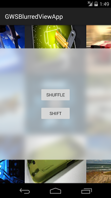

# GWSBlurredViewApp

The GWSBlurredViewApp shows several images blurred in the center of the application to show how the GWSBlurredView library looks when used. Normally, this would be used as a branding mechanism within the ListView header.

Video can be viewed here:
